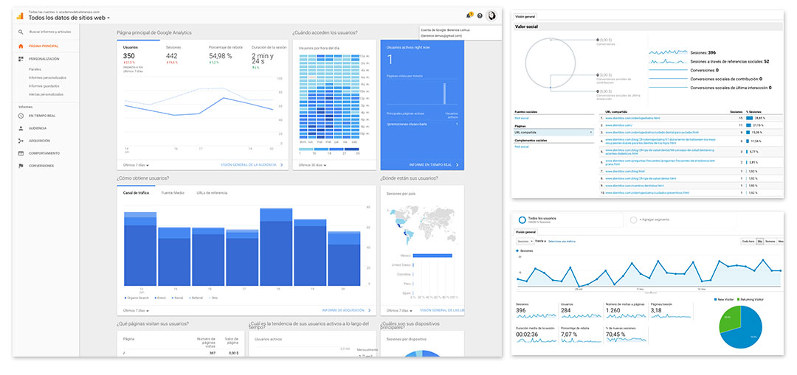
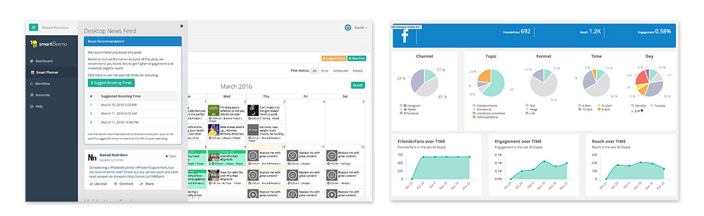
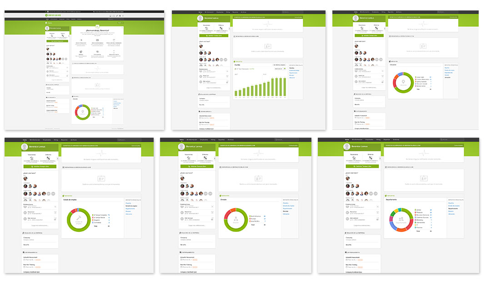
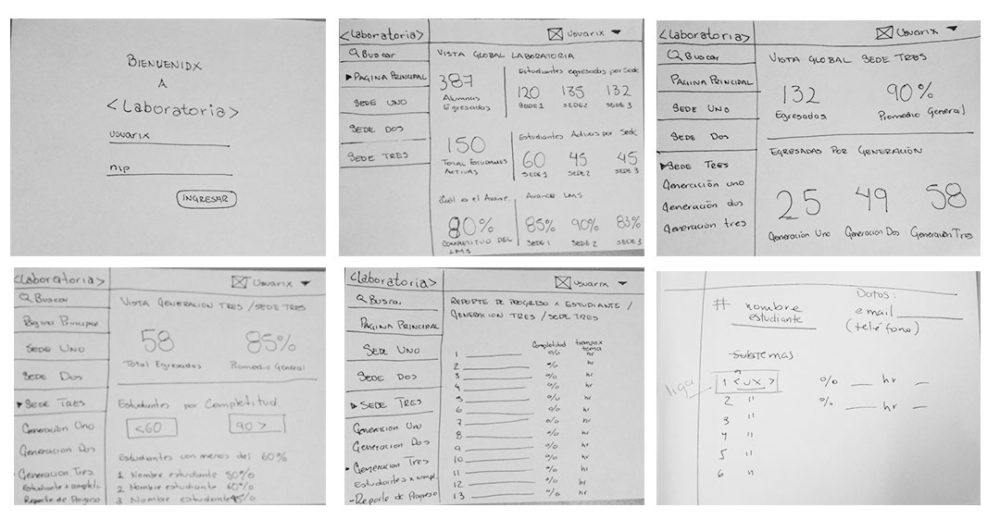

# **Data Dashboard**

## **Proceso de UX**

### **1. Descubrimiento e investigación**

__Usuarixs:__ Las personas que usarán el producto serán lxs Training Manager y Coaches de Laboratoria.

Training Manager - De ella depende el desarrollo y la retención del activo más valioso de la empresa: su talento. Planifica y ejecuta el programa de formación, coordinando a los coaches para que realicen de manera eficaz su labor, garantizando así  la mejor experiencia de aprendizaje en las alumnas a través de la toma de decisiones en el momento adecuado.

Coaches - Parte esencial del equipo de formación, brindan apoyo a las estudiantes durante el bootcamp asegurándose que desarrollen sus habilidades técnicas y socioemocionales para insertarlas en el mundo tech e iniciar su carrera en Front end y UX.    

__Necesidades de las usuarias:__  Analizar datos de todas las sedes de Laboratoria respecto al progreso de las estudiantes de una manera simple, permitiéndoles llegar rápidamente a la información más importante por sede o generación, así como número de alumnas activas de la generación actual; además de tener una opción para filtrar información detallada por cada estudiante que les permita ver su avance dentro del LMS del bootcamp tanto de manera individual como grupal permitiéndoles tomar las decisiones necesarias y ofrecerles la mejor experiencia de aprendizaje.

__Objetivos de las usuarias:__ Tener una interfaz donde lxs usuarioxs puedan ver y usar la data de progreso del LMS permitiéndoles agilizar la toma de decisiones.

__Pain points:__ El proceso de revisión de datos se ve obstaculizado por múltiples interacciones en la interfaz o por tener que acceder a varios documentos para obtener información completa de manera específica, destinando mayor tiempo a las tareas de seguimiento volviéndose poco eficaz.

__Sentimientos:__ * Frustración al tener que dedicar mayor tiempo en la revisión de distintos documentos para obtener información específica o completa. * Pérdida de tiempo por métodos poco eficientes para completar sus tareas de seguimiento a alumnas

__Técnicas usadas en esta fase:__  Entrevista personal llenando un formulario como protocolo. Grabación de voz para posterior transcripción de la información. Lista de preguntas: Ver documento anexo. (https://docs.google.com/forms/d/e/1FAIpQLSfZ_m90Og6JcHASow4WbVqtfzTilCeP7QURuS8TBn4BEuxc5w/viewform?c=0&w=1)

__5. Objetivos del negocio:__ De manera externa
* Ser la principal fuente de talento tech femenino de América Latina para el mundo
* Encontrar a las mujeres talentosas que se necesitan para cambiar el sector
* Ofrecer una educación de calidad para que las estudiantes construyan en 6 meses los skills técnicos y   socioemocionales para insertarse en el mundo tech e iniciar su carrera.
* Formar el talento en empresas para una transformación digital incluyente
* De manera interna
* Atraer y mantener al mejor talento,
* Generar las oportunidades para que las mujeres puedan empezar su carrera en tecnología
* Tener un ambiente de trabajo agradable para que los Laboratorians se sientan felices trabajando en Laboratoria

__6. Motivaciones del negocio para el data dashboard:__

* Mantener un seguimiento del progreso de las estudiantes y según ello tomar las decisiones necesarias para ofrecerles la mejor experiencia de aprendizaje.
* Facilitar el acceso a la información de manera rápida y con ello hacer más eficiente su trabajo
* Acceso a la información global y particular generada por cada sede, en especial de las Training Manager y/o el staff de Laboratoria.
* Saber en todo momento el número de estudiantes activas por sede de la generación en curso

### **2. Síntesis y definición**

__1. Cuáles crees que son los datos más importantes a tener en cuenta para el Data Dashboard:__

   - Sobre las estudiantes (porcentajes y cifras absolutas):
    * Número global de estudiantes por sede
	* Número de estudiantes activas en generación actual
	* Número de estudiantes por generación (entrantes y egresadas)
	* Avance en el LMS general y por estudiante
	* Nivel de completitud por temas y subtemas
	* Alumnas con menos de 60% de progreso
	* Alumnas con más del 90% de progreso

__2. Lo que los usuarios esperan obtener:__
	* Una visión más sencilla y fácil del avance de las estudiantes tanto de manera global como individual
	* Acceder a toda la información desde un solo lugar sin abrir tantos documentos
	* Identificar a las alumnas con menos de 60% de progreso
	* Identificar a las alumnas con más del 90% de progreso
	* Disminuir el tiempo de revisión de la información por alumnas
	* Obtener rápidamente datos de consulta frecuente como total de alumnas y egresadas por sede, por generación, número de alumnas activas
	* Tener un perfil personal para acceder a la información
	* Identificar a las alumnas relacionándolas con una fotografía

__3. Insights:__
	* Concentrar toda la información en un solo lugar
	* Optimizar el tiempo de análisis y seguimiento del avance de las alumnas
	* Acceder de manera rápida a información precisa
	* Tener una visión clara del avance de toda la generación de estudiantes
	* Tener una visión clara del avance individual de cada estudiante

__4. Data proporcionada:__

     -_Data relacionada a los cursos:_ Ver documento anexo.

     ├── data
     │   └── sede
     │        ├── generacion
     │              ├── cuarta
     │                   ├── estudiantes
     │                         ├── 0
     │                             ├── correo
     │                             ├── nombre
     │                             ├── progreso
     │                                  ├── duracionPrograma
     │                                  ├── porcentajeCompletado
     │                                  └── temas
     │                                       ├── 01-Introduccion-a-programacion
     │                                             ├── duracionTema
     │                                             ├── duracionTemaCompletado
     │                                             ├── porcentajeCompletado
     │                                             ├── subtemas
     │                                                  ├── 00-bienvenida-orientacion
     │                                                       ├── completado
     │                                                       ├── duracionSubtema
     │                                                       └── tipo
     │                                                  ├── 01-desarrollo-profesional
     │                                                       ├── completado
     │                                                       ├── duracionSubtema
     │                                                       └── tipo
     │                                                  ├── 02-por-que-aprender-a-programar
     │                                                       ├── completado
     │                                                       ├── duracionSubtema
     │                                                       └── tipo
     │                                                  ├── 03-tu-primer-sitio
     │                                                       ├── completado
     │                                                       ├── duracionSubtema
     │                                                       └── tipo
     │                                                  └── 04-quiz
     │                                                       ├── completado
     │                                                       ├── duracionSubtema
     │                                                       ├── puntuacion
     │                                                       └── tipo
     │                                             ├── subtemasCompletados
     │                                             └── subtemasTotales
     │                                       ├── 02-Variables-y-tipo-de-datos
     │                                       └── 03-UX
     │                             └── turno
     │              ├── quinta
     │              └── tercera

__5. Insights del negocio:__ Toma de decisión. Tener datos que reflejen resultados del programa de formación para tomar decisiones respecto a su mejora

### **3. Ideación**
(Acá se comienza a pensar esa solución tomando en cuenta la información recopilada y procesada)

#### Referencias Gráficas

Google Analytics: 
Smart Beemo: 
Bamboo HR: 

El proceso de ideación comienza con la búsqueda de referencias gráficas de plataformas con datadashboard, para saber cuáles son los estándares de presentación de los elementos de información.

De este análisis, surge de manera consistente, el uso de una barra lateral izquierda de manera fija en el que se ubican los elementos de menú que pueden desplegar submenús.

##Objetivos
Las metas que pretendemos alcanzar con la implementación de este nuevo diseño son: mejorar la accesibilidad como una herramienta para las training manager que apoye la visualización del avance de las alumnas durante el bootcamp  de  una manera más gráfica y accesible  a través de una imagen moderna y minimalista que permita ver los datos más importantes tanto de manera general como particular.

Descripción
cómo los elementos del diseño ayudan a la consecución de los objetivos propuestos:

Impresión general: un diseño limpio y sencillo, implementando los colores de Laboratoria que permita una continuidad del estilo de la marca, enfocado principalmente  para las training manager permitiéndoles acceder tanto a la información general de Laboratoria como consulta rápida, como al avance en el LMS de cada estudiante en particular, permitiéndoles ver los puntos de mejora y facilitarles la toma de decisiones

Layout: explica un poco el porqué de la distribución de los elementos de una determinada manera. Si el layout da mucha importancia a las áreas vacías y el espacio en blanco explica por qué es necesario.
Paleta de colores: puede ser acorde a la identidad corporativa de la marca o no. Justifica la elección de una paleta fría, cálida, monocromática, variada… Comenta si has usado el color como ayuda para separar contenido o enfatizar información.

Tipografía: serif, sans-serif, clásica, contemporánea, legible, corporativa… pero no te pongas muy pesado. Este puede ser el momento de hablar cómo el tamaño de la misma apoya la jerarquía de los contenidos.
Fotografía/ilustración: El uso de fotografía o ilustración representa una oportunidad única para conectar con nuestra audiencia. Puedes escribir sobre cómo las imágenes que has usado apoyan un determinado concepto, van dirigidas a cierto target o puede que simplemente estén en consonancia con la paleta de colores.

### **4. Prototipado**

Sketch: 

Prototipo en figma: [prototipo inicial sprint 1] (https://www.figma.com/proto/tdsS4b7gtPGBIhFlMjCOQH/01-Laboratoria-Login?scaling=scale-down&node-id=47%3A4)

(https://www.figma.com/proto/tdsS4b7gtPGBIhFlMjCOQH/01-Laboratoria-Ajustes-Feedback?scaling=scale-down)

### **5. User testing**
